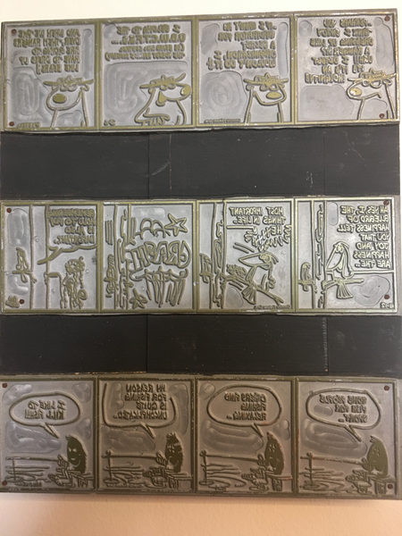
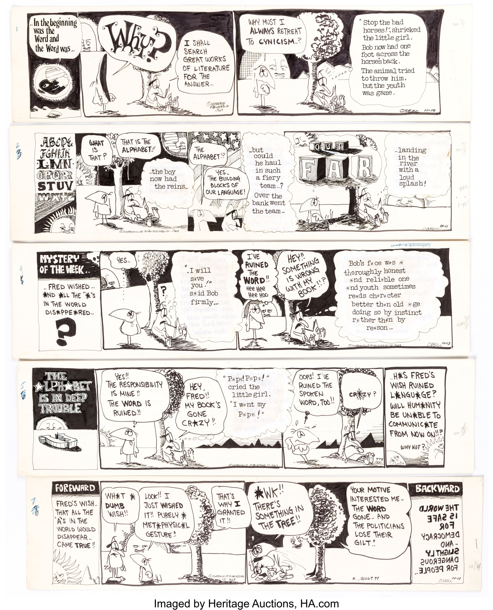

Odd Bodkins is one of my favorite strips.  Or at least Odd Bodkins
Item: _A printing plate with three Odd Bodkins Comic Strips_  
Location: _South wall of my work office, next to the whiteboard_  
Acquired: _eBay, circa 2019_  

---

Today's office tchotchke is a printing plate for three of Dan
O'Neill's "Odd Bodkins" comic strips that I bought on eBay a few
years ago.

*was* one of my favorite strips; it hasn't been published in years,
and I don't think I've looked at any of my Odd Bodkins collections
in a long while.  But when I was in high school, it was perfect for
the hippie-wanna-be that I was.  I liked the strange, sometimes
not-so-coherent storylines.  I liked the leftist political humor.
I liked O'Neill's non-realistic characters.  I liked the arguments
about Indians vs.  Harleys.  When I look back at strips from time
to time, I still do.

O'Neill was also an interesting character.  He did some great work
using the Disney characters as representatives of America, doing
the things Americans did in the late 1960s: Shooting people, having
sex, taking drugs, profiting off the poor.  Disney was not happy [1].

From time to time, I've thought about buying some of the Odd Bodkins
originals that appear on eBay.  But (a) they are expensive, and I'd
rather spend the money on, say, a Walt Kelly original; and (b) I'd
prefer that the originals end up in the [Dan O'Neill comics archive at 
UC Berkeley](https://oac.cdlib.org/findaid/ark:/13030/c8h999sq/admin/).
Nonetheless, I do the occasional search.  When I saw the printing
plate for sale, I decided to pick it up on a lark.  It now hangs
in my office.

I like having a printing plate.  It reminds me of the letterpress
we have on campus and the few times I've had a chance to use it.  I
like that it's somewhere between the artist's work and what we see
as consumers of the work.  I like that it was made as something
ephemeral but somehow managed to survive.

I do wish that someone would reprint all of the Odd Bodkins strips.
I wish more people knew about O'Neill and Odd Bodkins.  I'm glad to
see that [he's still making art](http://danoneillcomics.blogspot.com/).

I think it's time to dig out the five-or-so Dan O'Neill books I
have.  And maybe I can find an excuse to visit the Dan O'Neill
archive at Berkeley.  Perhaps I could make the strip a topic for a
sabbatical project.  O'Neill certainly has fun with language.  And
maybe computers play a role, somewhere.  I've forgotten.  I'll need
to read them again.

---

**_Postscript_**: Just in case you can't read mirror-image text, I've
transcribed it.

**Strip 1**

_Panel 1_: Bear (possibly Smokey Bear): "Perhaps you think I enjoy
dressing up like a ranger??  Ugh!! I detest it!  It's an Indignity!!

_Panel 2_: Bear: "If I wasn't an infiltrator for a secret organization,
I wouldn't do it!!"

_Panel 3_: Bear: "I belong to the U.B.W.C.T.F.S.S. ... (Us Bears Will
Control The Forest Service Someday)"

_Panel 4_: Bear: And when we take over them rangers are going to have 
to dress up like bears.

**Strip 2**: 

_Panel 1_: Bird: "Ah Yes, I, The Bluebird of Happiness tell you that
joy and happiness are the .."

_Panel 2_: Bird: "Most important things in life .. Hey y y y".  Branch:
"CRACK"

_Panel 3_: CRASH!

_Panel 4_: Other Bird: "Remembering how to fly is also important."

**Strip 3**

_Panel 1_: Black Hairy/Inky Chararacter Whose Name I Forget: "Some people
fish for sport .."

_Panel 2_: BH/ICWNIF: "Others find fishing relaxing .."

_Panel 3_: BH/ICWNIF: "My reason for fishing is quite uncomplicated .."

_Panel 4_: BH/ICWNIF: "I like to **KILL** fish!!!"

No, these aren't my favorites.  And, although they have Smokey Bear (I
think) and The Bluebird of Happiness and the Cousin It variant,
they don't have Fred the Bird or The Chararacter With Glasses Whose
Name I Forget.  Here's a set with those two characters from a recent 
auction.

---

**_Postscript_**: I thought this musing would be quick.  But I ended
up spending too much time wandering around the Interweb trying to
figure out what O'Neill is up to these days, and cursing that the
person who bought those five strips has marked them up to about 
2.5 times what they paid for them at auction.

---

[1] Here's a video about it that I discovered in my recent explorations:
<https://www.youtube.com/watch?v=Dlm6A0NrSAw>.
