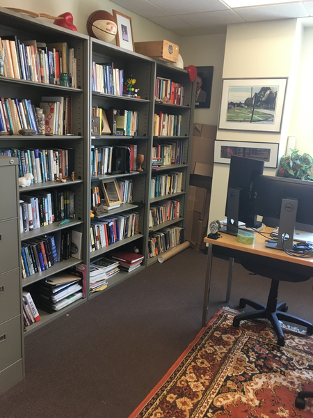
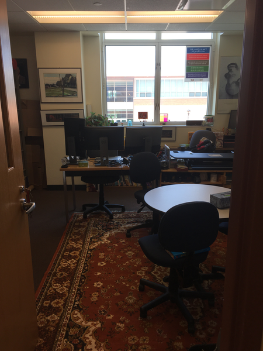
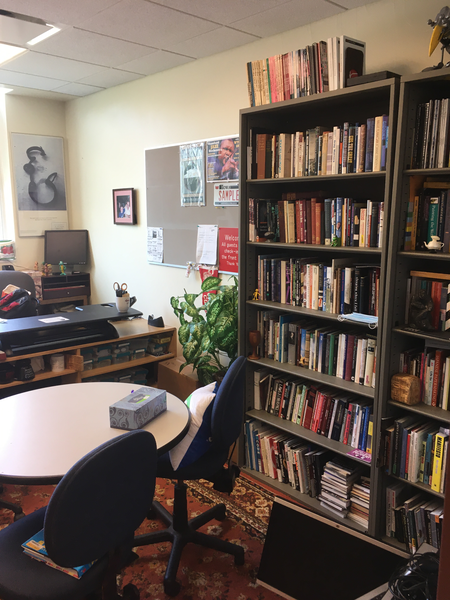

I've finally completed the move to my new office.  This office is
my fourth at Grinnell.  I hope that it's my last.  I don't like
moving offices.  If you visit my office, you'll see that it's filled
with not just books (and computers), but a variety of "stuff".  I
often refer to the stuff as "tchotchkes" or "ephemera" or just
"cr*p".  Some photographers who've visited the office say that all
the stuff gives my office "texture", whatever that is.

In any case, as long as I've moved the stuff, it seems to me that
I should write about it.  I'm also inspired to write because one
of my sons asked something like,

> If you'd died, how would we know what was important?

I think the answer is best phrased as,

> If you decide it's important, then it's important; if you decide
  it's not important, then it's not.  Does it really matter what's
  important to me?

But perhaps it's nice for them to know more about what I like and
why.  Or at least why I've accumulated the things I've accumulated.
The things I inherited from mom (and why she kept them).  The things
that relate to particular interests.  The things that I just found
had meaning to me.  The things that might just add texture.

So I'm going to start a new series of musings, the "Tales of
Tchotchkes".  At some point, it will grow beyond what is in my
office to what's in my lab and what's at home and books and whatever.
The tales of a hoarder never end!

Let's see how long I can keep up musing about materials.  Or, more
precisely, let's see how long my muse wants me to spew about stuff.

---

**_Postscript_**: Now that I look around the office, I find myself
wondering whether I have more stuff in another box that I packed
two years ago when I went on sabbatical.  I'll need to search the 
lab.

But it's the lab.  It's chaos, exemplified.  So searching the lab
will be hard.

I'll search the lab; really I will.

Someday.

---

**_Postscript_**: If you see something in any of those photos that
you want me to discuss, let me know.  Otherwise, I'm just going to
write about the things in whatever order my muse chooses.

---

**_Postscript_**: The office is not yet in its final state.  I have
three shelves with books on them that I hope to give away soon.
I'm not sure what will go on those shelves next.  There's a computer
on the floor that ITS is supposed to take away.  Maybe I'll bring
it to technology drop-off day.  My monitors should be on my standing
desk.  Unfortunately, my standing desk is broken.  So they've
migrated to my work table, which I hope to keep (mostly) clear.  I
don't know what I'm doing with the small monitor in the corner by
the windows.  My students have borrowed my fake flowers for the
summer.  I'll probably get rid of the broken-down boxes at some
point.  I might move my giant wood sculpture back to the office.
And, as I mentioned, I think there are more tchotchkes to unpack
that are buried somewhere in my lab.  Things will change!

After a few years, I may also find that I prefer a different
arrangement of furniture.  We shall see.

---

**_Postscript_**: I don't understand the people I see on videoconferences
who have blank walls behind them.  As the photos of my office
suggest, if I don't have bookshelves on a wall, I put up art.  I
can't think of any significant areas of blank wall in my life, at
least not in spaces I control.

---

**_Postscript_**: You may note that my office is moderately straight
right now.  I hope to keep it that way.  Feel free to lend me words of
encouragement if you stop by and it's not straight.

---

**_Postscript_**: A few years ago, the University of Chicago alumni 
magazine did a story on professors with over-full offices.  It would
be fun if the Grinnell magazine did so, too.  Let's see ... the ones I
know of with lots of "texture" include David Campbell's, Henry Rietz's,
and Jim Swartz's.  There must be others.

---

**_Postscript_**: Astute observers may note that is now a second
bookcase next to my bookcase of art and design books.  I appreciate
that FM installed another bookcase!  I almost fit all the books I
planned to put in the bookcase there.
