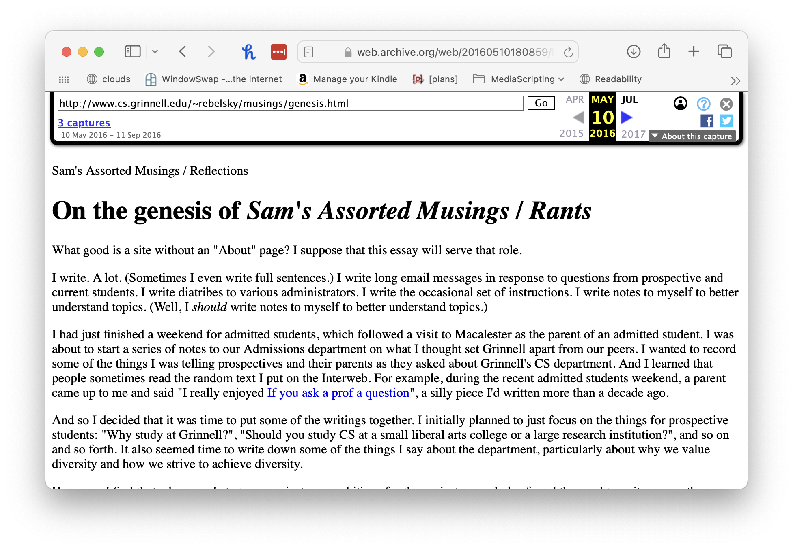

As far as I can tell, this is my 1300th posted assorted musing or rant. Since it's a multiple of 100, I feel like I should step back and reflect on the activity. Yes, it's a "meta musing". 

1300 seems like a lot. However, it's far fewer than I might have reached by this point. I started on April 19, 2016, more than eight years ago. Eight years of 365 days is, um, more than 2800 musings. Damn! I'm not even averaging one every two days. 

On the other hand, I could have given up. So 1300 is also good. And I'm still musing.

Why do I muse these days? At one point, I mused to get things out of my system and to put common answers in an easy-to-reference place. Somewhere along the way, musing also became an opportunity to work on improving my writing [1]. But I'm less angry than I used to be [2], and, in any case, my family wants me to avoid ranting in public. I'm also finding fewer "reference pages" that call out to be written. The recent [what I wish I'd known when I came to Grinnell](what-i-wish-id-known-2024-08-06) is an obvious exception. I suppose there are times I've written for the positive feedback I get from writing. However, these days, I typically get fewer than ten likes on any post and get only a few comments. I know I have readers, because I get email from time to time, but I feel like I have fewer readers [3].

Whoops. I didn't answer the question yet. Still, it seems valuable enough to reflect on why I've mused in the past as I attempt to determine why I muse now. And "reflecting" is a crucial reason I muse. I sit down and write because writing helps me figure things out. The musing on [my end-of-course evaluations](teaching-reflections-2024-05-30) was one such instance [4].

Wow. I seem to be putting off the answer. As I said, I'm writing to reflect. I know! I'll go through the last 100 or so musings and figure out why I wrote them.

* 1299: ["and'd"](andd-2024-08-12). _A rant!_
* 1298: [Planning updates for CSC-207 in Fall 2024](csc-207-2024fa). _I wrote this to get myself to think about changes to that course._
* 1297: [Three weeks to go](three-weeks-to-go-2024-08-08) (Musing #1297) . _I wrote this to plan for the start of the semester._
* 1296: [What I wish I'd known when I started at Grinnell](what-i-wish-id-known-2024-08-06). _I wrote this because I thought it might help others._
* 1295: [A draft sabbatical application letter](sabbatical-letter-2024-08-05). _I wrote this because I have to write this at some point._
* 1294: [Sabbatical planning](sabbatical-planning-2024-08-04). _I wrote this to get ready for the next musing._
* 1293: [What kind of computer should you buy? (2024 version)](buy-computer-2024). _I wrote this because people keep asking me._
* 1292: ["Tomorrow's my birthday"](tomorrow-birthday-2024-06-16). _I don't remember why I wrote this._
* 1291: [Unintentional mashups](unintentional-mashups-2024-06-15). _I wrote this because I needed to get the idea out of my mind._
* 1290: [My current approaches to mastery grading](mastery-grading-2024-06-12). _I wrote this to inform and, perhaps, influence. It also seems like an opportunity to think more carefully about what I do. And it provides an answer to "Please explain your grading."_
* 1289: [Gaining seniority](gaining-seniority-2024-06-08). _I wrote this to help myself figure out just how senior I was becoming._
* 1288: [Learning assessments](learning-assessments-2024-06-05). _If I recall correctly, I wrote this in preparation for the mastery grading musing._
* 1287: [My professional responsibility to complain about technology](acm-code-25-2024-06-04). _A rant, of sorts._
* 1286: [Developing and presenting AI policies for the SIGCSE Technical Symposium](sigcse-ts-ai-2024-06-03). _Writing about writing._
* 1285: [Living with depression](depression-2024-06-02). _Support for students? An indirect response to a request from a colleague._
* 1284: [Reflections on my teaching](teaching-reflections-2024-05-30). _An opportunity to think through my teaching evaluations. Nope. I'm wrong about that. Damn! Where is that reflection? Ah! It's in a postscript._

That's enough. I'm bored already. I bet you are, too. And I'm not close to 100. Did I learn anything while annotating those? Yes.

_I still rant!_ While I'm doing my best not to rant about Grinnell (or not to rant excessively about Grinnell), I can still rant about bad software, inappropriate UI design (see, for example, the musing on [using arrows as "submit" buttons in Qualtrics](qualtrics-submit)), and more.

_I still try to document things I do and decisions I make._ Sometimes, that's in the context of things I'm writing already, such as the musing about AI policies for SIGCSE TS. Sometimes it's about teaching techniques, such as mastery grading. I hope that by musing, I can have something to point people to. Or, at least, I'll have something to crib from when I write responses.

_I still write to think through things._ Although it's not in the list above, I'm using a musing to explore where composition belongs in CSC-207 [5].

_I still enjoy "musing"._ These past few days, while I've been getting close to this musing, I've also been "writing ahead" a bit. I have drafts of significant parts of two or three more musings. Perhaps I enjoy musing for the prior reason: It helps me think through things. In addition, promising myself that I will muse forces me to move forward on various projects.

_I'm still "open"._ Some time in the past year, a computer scientist at another institution wrote me a note saying (approximately), "I really appreciate how open you are in your musings and rants." I believe in open-source software. I believe in various forms of open education. Why not an open personality? More seriously, I believe the world is better when we admit our fears and mistakes [6]. I heard from a few people that my musing on depression helped.

_My muse still calls me toward semi-pointless pieces._ Does anyone care about the "[unintentional mashups](unintentional-mashups-2024-06-15)" that were bouncing through my brain? How about [stupid Grammarly mistakes](andd-2024-08-12)?

I still have good reasons to muse. At the very least, musing gets me to reflect on various parts of my job; it helps encourage me to get work done more promptly and think more deeply about particular issues. 

I have a lot of other writing to do this year. As I've noted recently, [I'm writing a lot of new material (both text and code) for CSC-207](csc-207-2024fa). Will I also have time to muse? I hope so. Stay tuned. At this moment, my goal is to post at least every-other day [7].

---

What else belongs in the 1300th musing. Clearly, this musing needs [an old snapshot of the site](https://web.archive.org/web/20160510180859/http://www.cs.grinnell.edu:80/~rebelsky/musings/genesis.html) from [archive.org](https://archive.org).

I'd forgotten that I didn't use secure HTTP back then. And that I hadn't yet added decent styling [8]. I'd also forgotten that I used "reflections" before I switched to "rants". And I was less explicit about the self-reflexive acronym. 

---

My muse initially suggested that I reflect on my (poor) choice to put everything on one directory. GitHub now tells me that "we had to truncate this directory to 1,000 files. 608 entries were omitted from the list." I think they mean "this directory listing". At least I hope so.

At some point, I might make more significant changes to the site's structure. We'll see. I like to keep URLs consistent, so it will be complex.

---

My muse says that I should also determine how much time I've spent musing [9]. That's hard, because there are many factors at play. Some musings only take a little while to draft; others take hours upon hours. I edit some carefully. I leave others as an unedited mess. Plus, there are bunches of musings that I started but never finished, or finished but never posted. Let's do a rough back-of-the-envelope calculation. Let's say I spend two hours on a musing on average, which is probably and under count.

1300 musings is 2600 hours. 2600 hours is 56 forty-hour weeks. So the musings represent approximately one year of full-time work. Wow! I wonder if I can count them as my sabbatical work. Maybe my final sabbatical will involve selecting important musings, rewriting them, and assembling them in some way.

Was the year of work worth it? I think so. It certainly helped me make connections. It may have even encouraged some people to come to Grinnell. And some musings may have helped others.

---

[1] Grammarly says I should use "improve my writing". However, to me, making an effort to improve does not necessarily guarantee improvement.

[2] Yay therapy!

[3] Whine, whine, whine.

[4] Um ... I'm not convinced that that musing is about EOCEs.

[5] Object-oriented problem-solving, data structures, and algorithms. (Just in case you forgot.)

[6] I also think the world is better when we celebrate people's achievements.

[7] No, Grammarly, "every other day" is not the same as "every-other day". The latter indicates alternating days. The former (which you've suggested an alternative) indicates that I write on "other days", whatever those are. Perhaps the alternative to "some days" (or "sum days").

[8] Yes, I'll claim that I have decent styling.

[9] And ranting [10].

[10] Or reflecting.
