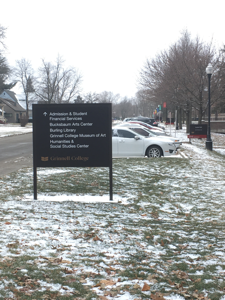
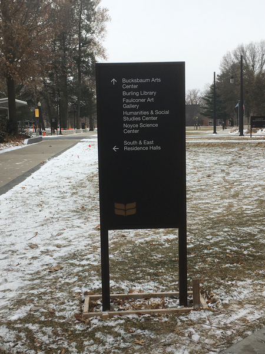
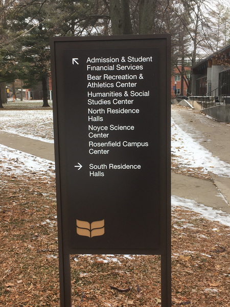
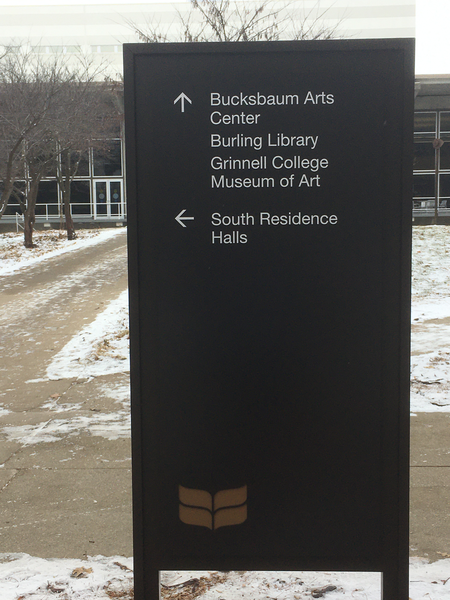

User studies in campus navigation
=================================

*Topics/tags: [Rants](index-rants), [Grinnell](index-grinnell)*

Grinnell's campus has seen many physical changes in the past year
or so, including the new admissions building, the HSSC, movement
of departments [1], new walls and gates, new signage, and a bunch
of new wayfinding signs.  This musing [2] is about the last issue.

I love the idea of signs that help guide people through campus.
But I have questions about the implementation.  I know that if I
were asked to make the signs, I would have made the arrows point
in different directions.  For example, there's a big sign at the
corner of 8th and East that seems to indicate that one should go
south to reach the HSSC and Admissions [3].  I would have had the
arrow point east.  There's a sign right after you cross 8th southward
between the HSSC and Noyce that indicates that both are straight
ahead.  I would have said that Noyce was to the left (or diagonally
to the left) and that the HSSC was diagonally to the right.  There's
a sign at the intersection of the East-West path that runs south
of the Forum and the North-South path that runs west of the Forum
that seems to indicate that you should follow the diagonal path to
get to Noyce, while I would tell someone to go straight ahead.

Part of the problem may be how you interpret signs.  Does a left
arrow mean "turn left right before this sign" or "turn left after
this sign"?  Or is it perhaps situational?

There's also a question of which building names you put on which
signs.  I'm surprised that many signs indicate the direction to only
one or two of the dorms, rather than all three.

In any case, I would have made very different signs [4].  However,
it's not clear that my signs would have been more useful. While
there is, of course, clear evidence that I am a fount [5] of wisdom
[6], it's also the case that I think differently than others [7].
But I also know that others find the current signs confusing; I'm
pretty sure that at least one colleague tried to follow signs to
Noyce and decided that they make you circle the building.

So how do we determine what is best?  I'd suggest user studies.
Pick some interesting tasks, such as "Find Noyce from the corner
of 6th and Park" or "Find the handicap entrance to Steiner from the
Forum parking lot" or "Get a parking pass so that you can park
behind the Chrystal Center" or "Visit the Grinnell Museum of Art
starting at the JRC [8]".  Then ask people to accomplish those tasks
using the signage and see where they get confused.  Ideally, we'd
run the tests with different choices of directional signage and see
what works best.

I believe that when we designed the signage for the interior of
Noyce, we used a form of crowdsourcing.  That is, we put up paper
signs with what we thought would be good directions and then asked
people to correct and comment on those signs.  Those who've tried
to navigate Noyce know how well that worked [11,12,14].

Will we do something systematic to improve the signs, or
will we just rely on gut instinct and a resolution to the occasional
complaint?  I would hope for the former but I expect the latter.

---

Postscript: While I think all of the tests would be valuable, I'd
particularly like to challenge those who made the signs to navigate
campus in a wheelchair, using only the signs, and find the accessible
entrance to each building. 

*Wait a minute!* Don't we have a team of students on campus that's
supposed to assess the accessibility of buildings?  They must have
been consulted on the signage and how to address accessibility in
that signage.

Are you done laughing yet?  That's not how we do things at Grinnell.

Back to reality.  Let's run the tests.  Maybe we should add a time
limit, too.  And let's consult the accessibility team.

---

Postscript: I am told that our accessibility leaders were consulted about
the font and the colors for the new signs, so that's a start.  I
am also told that folks listened when some accessibility folks on
campus said "That sign is misleading about the accessible entrance."
I just wish that there was earlier conversation about placement and
other issues.  At least it's easy to change the signs [15].

---

Postscript: To my friend Adena Schutzberg, I say *#GeographyIsEverywhere*.
To my friend Janet Davis, I say *#HCIisEssential*.  To my friend who
circled Noyce, trying to follow the signage, I say *thank you*.  To
my colleagues in accessibility services, I say
"*#DiversityIncludesDisability*".

---

<figure class="figure">

<figcaption class="figure-caption">The sign at 8th and East, facing south.  Aren't the HSSC and the Admissions Building to the right?</figcaption>
</figure>

<figure class="figure">

<figcaption class="figure-caption">A little bit south of 8th, facing south, between Noyce and HSSC,  I think of Noyce as being to the left and HSSC as being to the right.</figcaption>
</figure>

<figure class="figure">

<figcaption class="figure-caption">Isn't Noyce straight ahead?  And which way do I go if I want to go to the East Residence Halls?</figcaption>
</figure>

<figure class="figure">

<figcaption class="figure-caption">A bonus sign.  You should know where it is.  I'd make the Bucksbaum and Grinnell College Museum of Art arrows point diagonally to the right.  After all, that's the sidewalk one should take.</figcaption>
</figure>

<figure class="figure">

<figcaption class="figure-caption">A bonus sign.  This one is right after the new gate to campus across from Nollen House.  I'd like to see arrows to the East and North residence halls, too.  I'd also go straight to get to Noyce.  We may need a bigger sign.</figcaption>
</figure>

---

[1] For example, Analytics and Institutional Research moved to 1127
Park Street, Art History moved to Goodnow, and Careers, Life, and
Service moved to the Chrystal Center.

[2] Rant?

[3] This example, and others, can be found at the end of the musing.

[4] I also would have placed some in different locations, but that's
another issue.

[5] [Grammarly](index-grammarly) thinks I should use "font".  It's
wrong.  At least it didn't tell me to use "typeface of wisdom".

[6] That was intended as humorous.  I'm arrogant but not that arrogant.

[7] Isn't that one of Grinnell's slogans.

[8] "There's a sign here that says 'Faulconer Art Gallery'.  Is that
the same thing?" [9]

[9] We renamed the Faulconer Art Gallery to the Grinnell Art Museum
*before* the signs were made and installed, or at least before they
were installed.  Why do so many still reference the Faulconer?
Didn't Communications tell us that consistency is important in
developing a brand? [10]

[10] I'm not trying to lay the blame on Communications.  I'm not even
sure that they have direct responsibility for the signage.  I'd just
like to see it done right.

[11] If you haven't tried to navigate Noyce, you may not be aware that
most people have difficulty finding their way through the building.

[12] I'm not sure that the problem has to do with signage as much as
numbering and layout.  For example, it's not immediately obvious that
the only ways to get to the third floor involve finding the stairwells
at the north-east or north-west corners of the building or the elevator
near the Northeast corner.  Evidence also suggests that many people
don't know their cardinal directions in Noyce.

[14] There are those who claim that the Noyce layout is part of a long-term
study by Tom B, emeritus professor of psychology, on navigation, and that
there are cameras scattered throughout the building to gather data for
his study.

[15] I've heard that you can just scrape off the vinyl letters and
put new ones on.

---

*Version 1.0 of 2019-12-18.*
