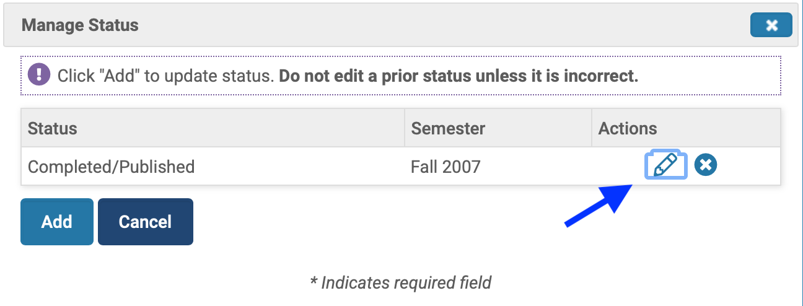
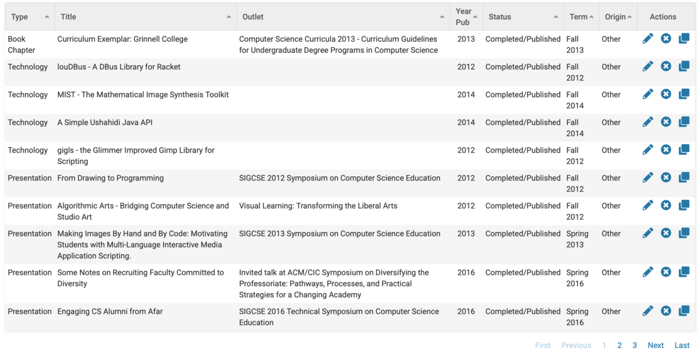

For too many years, faculty members at Grinnell have had to report
their work and accomplishments using [Sedona](https://sedonaweb.com).
Just the mention of Sedona was enough to get people to groan.  Why?
Lots of reasons.  Here are a few.  Like most reporting software,
it forces you to fit the round pegs of your activities into the
square holes designed by administrators (and not even administrators
at Grinnell).  It has no natural way to input publications, so you
(or your academic assistant) must retype information that is already
available digitally.  And the interface is, shall we say, clunky.
It's what you'd expect from someone who hasn't studied UI/UX.  And
it's what you get when you choose software from a small shop.  I
still don't understand why we didn't roll our own [1].

Because of our experiences with Sedona, most faculty greeted the
announcement that we were moving to Interfolio with joy.  After all,
Interfolio is a much larger corporation; surely it would be better
than Sedona plus other local hacks.  And the first things we heard
were promising.  For example, we learned that it would important
publications from the standard formats, including from EndNote and
BibTeX.

I've just completed my first extended encounter with Interfolio.
And I can report that ... it's just as bad as Sedona, perhaps
worse.  Why?  We're still forced to fit round pegs into square
holes; they're just different square holes (and perhaps more of
them).  It still appears to be designed by people unfamiliar with
concepts of user experience.  Bibliography import is notably
incomplete.  And, to make things worse, it's harder to extract data
from Interfolio than it is from Sedona.  Agh!

Read on for details.

My first experience was not good.  Just looking at the software makes
me groan.  "Vitas and Biosketches".  The software stores lives?  What
are they thinking?  But my Classicist friend tells me that they don't
mind the mangling of CV.  I suppose I shouldn't, either [3].

My next experience was okay.  Kind of.  I grabbed a few of my publications
in BibTeX [6] format from [The ACM Digital Library](https://dl.acm.org).
I used the only slightly confusing import tools.  And
... what do we find?

First, it appears that I have to add "Required Activity Information".  
That includes whether or not it's "Academic".  Conveniently, there is
no description of what it means for something to be academic.  Next
up is the "Diversity Contribution" [7,10].  "Intellectual 
Contributions: Review Type" comes next.  Our options are "Blind
Peer Reviewed", "Non-blind [11] Peer Reviewed", "Editorially
Reviewed", "Invited", or "Not Reviewed".  

Do they not know that "Blind Peer Reviewed" is an ableist term?
Sensible people have eliminated its use.  See, for example, [this
'blog post from the
APA](https://blog.apaonline.org/2020/02/20/an-end-to-blind-review/).  I
raised this issue with the Associate Dean, who raised with the
Amazing Administrative Assistant responsible for Interfolio, who
says that it's out of our hands; the Interfolio folks have to fix
it [12].

Where was I before I went off on that important tangent?  Oh, I
remember.  I was listing all of the extra information I had to
add for the paper.  There's also an "Invited" category.  Our
options are "Invited" (duh), "Not Invited", and "Submitted/Selected".
In most of my experience, anything not invited is submitted or
selected.  And that should be it.

But it's not.

Interfolio gets the semester of the publication wrong.  Presentations
from March are listed as "Fall".  Fixing that issue appears to
require that I (1) click on the "Edit" pencil icon, (2) click on
"Manage Status", (3) click on another pencil icon, (4) change the
semester, (5) click "Save", (6) click "Add", (7) close another
dialog box that pops up for no clear reason, (8) scroll
down, and (9) click "Save
and Go Back".  Further investigation suggests that I can skip steps
6 and 7 if I just click the close box for the dialog that appears
after step 5.

What happened to drop-down menus?

I guess I could deal with the annoyance if the input worked well.
But it doesn't.  Let's take an older paper as an example.  Here's
the lovely BibTeX entry, taken from ACM.

```
@inproceedings{10.1145/1227310.1227440,
author = {Davis, Janet and Rebelsky, Samuel A.},
title = {Food-First Computer Science: Starting the First Course Right with PB&amp;J},
year = {2007},
isbn = {1595933611},
publisher = {Association for Computing Machinery},
address = {New York, NY, USA},
url = {https://doi.org/10.1145/1227310.1227440},
doi = {10.1145/1227310.1227440},
abstract = {We consider in some depth a common exercise for the first session of a typical introductory
computer science course: The task of writing instructions to make a peanut butter
and jelly sandwich. The exercise, although simple, can engage students and motivate
a variety of topics important throughout the semester. We discuss reasons to use such
an exercise on the first day of class, present lessons students can learn from the
exercise, and give practical advice for the instructor who wishes to make the most
of this exercise.},
booktitle = {Proceedings of the 38th SIGCSE Technical Symposium on Computer Science Education},
pages = {372–376},
numpages = {5},
keywords = {manipulatives, active learning, introductory computer science},
location = {Covington, Kentucky, USA},
series = {SIGCSE '07}
}
```

Hmmm.  I guess it's not surprising that it gets the term wrong, since
the month isn't in the ACM data.  But also fails to import the DOI,
the page numbers, the URL, the "description" (abstract), and such.


Did I say the experience was good?  Well, it was okay.  At least it got
the authors, title, and conference right.  Since I often have a slew
of student co-authors, it's much better to be able to copy and paste
one long entry than to type them all by hand.  But the rest?  It sucks.
Bad UI.  Incomplete info entry.  Annoying extra info to enter.

Speaking of that extra info, it does seem that we continue to have
the round peg/square hole issue.  Let's take a look at that.

Conveniently, everything from Sedona was imported incorrectly, at least
in terms of the term I did work.  But I can't just fix the
date.  No, that would be too easy.  I have to answer potentially 
meaningless round/square questions.  For example, I served as an
external reviewer in Fall 2019, which got reclassified to Fall 2020.
When I moved it back, here were the new questions I had to answer.

* Diversity Contribution: "Yes" or "No")
* Professional Service Event Type: "Conference" or "Meeting" or
  "Workshop".
* Professional Service Organization Type: 
  "Academic Peer Reviewed Journal" or
  "Other Professional Publication" or
  "Academic/Professional/Research Conference" or
  "Academic/Professional/Research Conference - Track or Program" or
  "Academic/Professional/Research Conference - Session/Consortium" or
  "Academic/Professional/Research Conference - Workshop" or
  "Other".
* Professional Service Role:
  "Reviewer: Manuscript/Paper" or
  "Reviewer: Ad-hoc" or
  "Editor: Editor-in-chief" or
  "Editor: Associate Editor" or
  "Editor: Editorial Staff" or
  "Presenter" or
  "Panel/Round Table Participant" or
  "Discussant" or
  "Moderator" or
  "Guest Speaker/Lecturer" or
  "Keynote Speaker" or
  "Expertise-related Consultant/Advisor" or
  "Trainer or Training Staff" or
  "Interviewer" or
  "Judge/Evaluator" or
  "Chair" or
  "Co-Chair" or
  "Coordinator" or
  "Volunteer Staff/participant" or
  "Other Community Service Role" or
  "Reviewer: External Program" or
  "Reviewer: External Tenure and Promotion" or
  "Editor: special edition/guest editor" or
  "Other"
* Scope: "Local" or " State" or "Regional" or "National" or 
  "International"
* Type of Professional Service:
  "Adjudication" or 
  "Editorship" or 
  "Office held" or 
  "Committee assignment" or 
  "Chairing panel" or
  "Other"
```

Yes, we're forced to answer all of these questions.

What's the difference between "Professional Service Role" and "Type
of Professional Service"?  I have no idea.  Speaking of "Type of
Professional Service", let's take a look at that menu.


Do folks not understand that menus organized in no clear order are
particularly bad user interface design?  Either submenus or
alphabetical order would be better.

But the folks at Interfolio have skipped their classes in UI/UX
design and perhaps even the ones that describe the value in hiring
designers.  I must admit that most corporate software doesn't seem
to show a value for design; it appears that the people who specify
and purchase such software don't care.  They should; the lost
productivity from bad UIs far outweighs the cost of software.  In
any case, the design is ba.

Here's another fun example of Interfolio's design incompetency.  In
the section in which we enter our different kinds of information,
they have multiple "pages" for each section.  I have no idea what
they were thinking, other than "How much information can we cram
on one Web page?"  I'd love to see someone do a study of the usability
failures on this page.


Why am I spending all this time futzing with Interfolio?  Because
it's time for [my triennial salary review](salary-review-2021-10-23).
So I have to get the information correct.  Or correct enough. 

Of course, there's more to the salary review than just entering the
information and writing the essays.  You have to put everything together.
In the days of Sedona, we'd generate a Word document from Sedona with
all of the recent data, add our essay responses to each section, polish 
our CVs, and submit the CV and Word document to our Review Chairs.
Now, we upload our CV, fill in a form for the essays, upload diversity
and student research statements, and, um, somehow get the Interfolio/Sedona
data gathered up.  

How does that last part work?  I wasn't sure.  After too many email 
messages back and forth with the Associate Dean, I learned that we
were supposed to generate a "CV" (quotation marks intentional) for
the three-year review period [14] in Interfolio and then upload it
back to Interfolio.  What about our real CV?  It doesn't appear
that folks considered that.  I ended up combining the two PDFs into
one.

When we worked with Word documents, we had some control over the
formatting.  We don't have much control here.  But I wanted to 
see what it would look like for my Review Chair and the Faculty
Salary Committee.  Amazingly, the "Preview Packet" button doesn't
show that part of the Packet.  That's another question out to
our Amazing Academic Assistant.  I feel sorry that she has to deal
with all these questions from me.

As you might expect, the PDF previews are also bad.  Why do companies
write their own PDF preview and annotation engines?  Why don't they
test them?  A month ago, I pointed out that the search feature works
incorrectly; I've yet to hear anything back.  It also appears that
either Interfolio or the Interfolio PDF previewer has stripped some
information from my CV [16].

My conclusion?  Both Interfolio and the new, supposedly better,
Interfolio review process are *worse* than Sedona and the old
process, as hard as that is to envision.

You know what, I'd like to see the Associate Dean or Other Administrator
responsible for crap like Sedona and Interfolio (and the associated
processes) have to enter the data for all the faculty under review.
That is, we'd hand them our CVs, they could enter the data.  And
I'd like them to have to do the support, rather than dumping it on
an already overworked Academic Assistant.  Wouldn't that be great?
Maybe we'd eventually get half-decent software.  Or at least they'd
suffer as much as we do.

---

**Postscript**: You should send lots of good thoughts to the academic
assistant who has to manage Interfolio, including dealing with the
slew of questions from annoying folks like me.  And yes, I've tried to
limit the questions I've sent.

---

**Postscript**: It makes me surprisingly happy to discover that Grammarly
objects to both "Vitas" and "Biosketches" [17].

---

**Postscript**: Were you wondering about all of those steps I was
telling you about for fixing the publication semester?  Let's see ...
I've taken some screenshots.  I've added a short narrative, as well
as a few notations on the screenshots.

The semester is incorrect.  Click the "Edit" icon.


After what feels like too much time, but is only about eight seconds,
the edit page appears.  We click "Manage Status".


We click the edit button again.



It appears we should select a different semester.


And click "Save".


At this point, I'm not sure what to do.  The "Click
'Add' to update status" suggests that I'm not done yet,
and must click "Add".


Nope, that was wrong.  Close the new dialog.


I know from experience that I now have to save my changes.
Scroll down.


Ah, there's the set of buttons I know.  Click "Save
and Go Back".


Wasn't that fun?

Oh, I forgot to mention.  After I click "Save and Go Back" and wait
about five seconds for the updated page, the paper does not appear
in the list?  Why?  Because it's not on the first "page" of that
list.



Is it just me, or is that an awful lot of work (and time) to
just change the damn semester? [18]

---

[1] That's not true.  I do know why.  Grinnell is highly suspicious of
locally written software, even though some wonderful software has emerged
from the College [2].  We'd rather use less usable off-the-shelf software,
or re-jigger software for our purposes.  But that's a rant for another
day.

[2] Also writers of software.

[3] Instead of a résumé, an academic uses a _curriculum vitae_ (CV), a
"record of life".  There are many differences between the two.  
Résumés are typically short, a page or two.  A CV is generally
much longer, because it shows all that you have done, although, in some
situations, CVs are restricted.  In cases like that, you might write 
"32 refereed conference papers" rather than listing them individually,
or have a "selected publications" section.  But more is generally
better.

In any case, those with just the wrong amount of Latin end up
thinking that "vitae" is the plural of "vita", rather than the
genitive.  So they refer to one as a "vita" (life) rather than
"curriculum" (record).  To make things stranger, they then use
English rules for making a plural, thereby calling multiple CVs,
"vitas".  It makes my skin crawl.  "Please send us your vita."  No,
you may not have my life.  You may not even have part of it [4].

If you care, the plural of _curriculum vita_ is almost certainly
_curricula vitarum_.  I suppose if all of the CVs [5] are for 
one person, they might be _curricula vitae_.  But I may also have
just the wrong amount of Latin for that question.

[4] Today's inappropriate joke: I suppose that my willingness to
sacrifice my time to the College suggests that I fail to reject
the request for "vita".  Las year, we saw just how much I was close
to giving up.

[5] Yup, I'm using English-language rules for the plural of the
abbreviation.

[6] BibTeX is software that does a variety of things with bibliography
entries.  Most importantly, it allows you to format them in multiple
ways.  In contrast to much commercial software, it stores the entries
in human-readable format, so that you can edit them with a text editor.

[7] I'm pretty sure that "diversity contribution" is something
Grinnell added.  But I'm also pretty sure that this information
does not appear for publications in the reports [8] that Interfolio
generates, even though it does appear for other parts of the record.

[8] CVs, FARs [9], biosketches, and the ilk.

[9] Faculty Activity Reports

[10] Unlike some, I do not see the inclusion of "diversity contribution"
as an intrusion by the diversity regime, or whatever they call it.

[11] Sighted?

[12] Hmm.  Does that mean that "Diversity Contribution" is also
set by Interfolio?  I wonder.

[14] Four-year review period, this year [15].  Summer 2017 to Summer 2021.

[15] And next year, and the year after.

[16] Yeah, that's another question.

[17] I'm glad that some part of this musing made me happy.  I suppose
I also enjoyed writing it.  I almost always enjoy writing.

[18] It's even more work to take the screenshots, annotate them, write
alternate text, and then narrate.  Sometimes I make too much work for
myself [19].

[19] Often.
